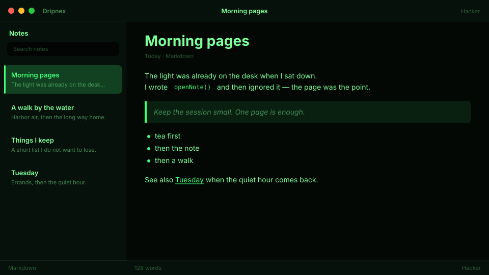

# Hacker

Green-on-black. Classic phosphor — a root shell after midnight.



```
dripnex/theme-hacker
```

## Palette

The chips live in [palette.html](palette.html) — open it in a browser. GitHub won’t paint HTML swatches here, so the hex list is below.

| Name | Token | Color | What it’s for |
| --- | --- | --- | --- |
| Base | `--bg-base` | `#030805` | Window background |
| Surface | `--bg-surface` | `#07110b` | Sidebar and chrome |
| Elevated | `--bg-elevated` | `#0c1a12` | Raised panels |
| Text | `--text-primary` | `#7dff9a` | Headings and body |
| Muted | `--text-muted` | `#7dff9a · rgba(125, 255, 154, 0.5)` | Secondary copy |
| Accent | `--accent` | `#3dff7a` | Selection and links |
| Active | `--status-active` | `#3dff7a` | Active status |
| Dropped | `--status-dropped` | `#e05a6a` | Dropped status |

Pick it for classic green-on-black, not amber CRT and not forest pine.
